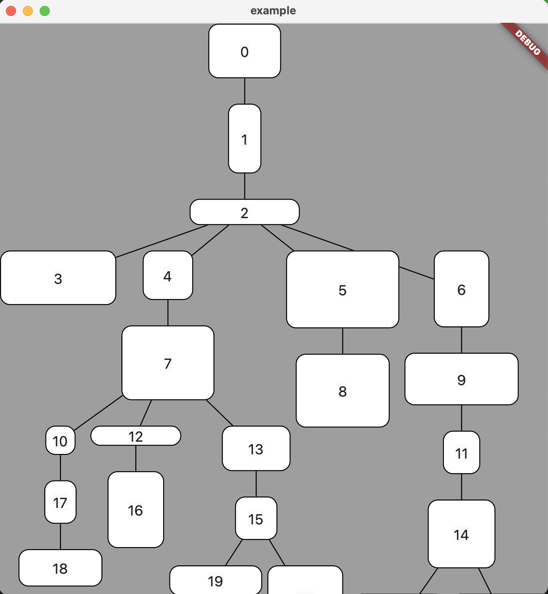

# Ploeg Tree Layout

This layout is the Ploeg adaptation of the extended Reingold-Tilford algorithm as described in the paper
van der Ploeg, A. (2014), Drawing non-layered tidy trees in linear time, Softw. Pract. Exper., 44, pages 1467– 1484, doi: 10.1002/spe.2213

The original implementation can be found on github at:
[non-layered-tidy-trees](https://github.com/cwi-swat/non-layered-tidy-trees)

This code is in the public domain, use it any way you wish. A reference to the paper is appreciated!

## Features



This implementation isolates the algorithm from the tree datastructure. The tree is obtained through via

```dart
  List<V> Function() roots;
  List<V> Function(V) next;
```

## Usage

```dart
    Map<int, List<int>> simpleTree = {
      0: [1, 2],
      1: [3],
      2: [4, 5],
      3: [],
      4: [],
      5: []
    };

    Map<int, Offset> nodePositions = {};
    Map<int, Size> nodeSizes = {};

    var algo = PloegTreeLayout(
        roots: () => [0],
        next: (v) => simpleTree[v]!,
        sizeGetter: (v) {
          Size size =
              Size(Random().nextInt(90) + 30, Random().nextInt(60) + 20);
          nodeSizes[v] = size;
          return size;
        },
        onPositionChange: (v, offset) => {nodePositions[v] = offset});
    algo.layout();
```

